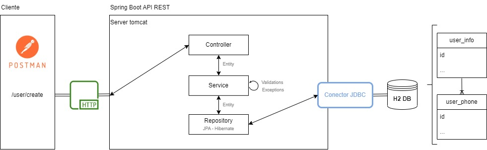

<!-- ABOUT THE PROJECT -->
## Acerca del proyecto

La siguiente demo trata de una API RESTful de creación de usuarios en Spring Boot. Se utilizo Gradle para su construcción, H2 para la base de datos en memoria y Hibernate (JPA) para la persistencia de datos.

Diagrama de la solución:



### Construido con

* Spring boot / Java
* Gradle
* H2


<!-- GETTING STARTED -->
## Getting Started

### Prerequisitos

- Considerar las siguientes versiones con las cuales se trabajó:
    - Java 11
    - Spring Boot 2.5.14
    - H2 2.1.212

<!-- TODO -->
### Instalación
1. Clonar el repo y situarse en el directorio raiz
2. Instalar depoendencias
   ```sh
   gradle build
   ```
3. Correr ejecutable
   ```sh
   java -jar build/libs/[jar-file-name].jar
   ```
4. Para probar los Test (groovy)
   ```sh
   ./gradlew test
   ```


<!-- CONTACT -->
## Contacto

carina flores coloane
